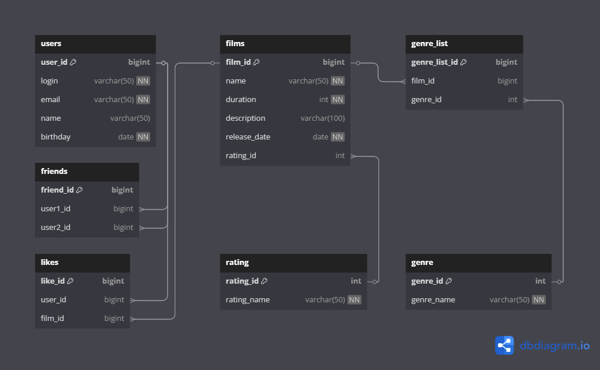

# ER-диаграмма проекта Filmorate



### Описание таблиц.
### `users`
Содержит данные о пользователях.
Таблица включает такие поля:
- первичный ключ `user_id`- идентификатор пользователя;
- `login` - логин пользователя, длина 50 символов, NOT NULL ;
- 'email' - адрес электронной почты, длина 50 символов, NOT NULL;
- `name` - имя пользователя, длина 50 символов, может быть пустым;
- `birthdate`- дата рождения пользователя, тип данных date, NOT NULL.

### `films`
Содержит информацию о фильмах.
Таблица включает такие поля:
- первичный ключ `film_id` - идентификатор фильма;
- `name`- название фильма, NOT NULL;
- 'duration'  - продолжительность фильма, NOT NULL;
- 'description' - описание фильма, длина 100 символов, может быть пустым;
- 'release_date' - дата выпуска фильма, NOT NULL;
- внешний ключ `rating_id` (ссылается на таблицу `rating`) - идентификатор рейтинга фильма.

### `friends`
Содержит информацию о дружеских отношениях пользователей.
Таблица включает такие поля:
- первичный ключ `friend_id` - идентификатор списка друзей;
- внешние ключи `user1_id` и 'user2_id' (ссылается на таблицу `users`) - идентификаторы пользователя.

### `likes`
Содержит информацию об отметках "нравится" (лайк) для каждого фильма.
Таблица включает такие поля:
- первичный ключ `like_id` - идентификатор "лайка";
- внешний ключ`user_id`  (ссылается на таблицу `users`)  - идентификатор пользователя;
- внешний ключ `artist_id` (ссылается на таблицу `films') - идентификатор фильма.

### `genre`
Содержит информацию о жанрах фильмах. У фильма может быть сразу несколько жанров.
Таблица включает такие поля:
- первичный ключ `genre_id` - идентификатор фильма;
- `rating_name` - текстовое название жанра, NOT NULL;

### `genre_list`
Содержит информацию о присвоенных значениях жанра для каждого фильма.
Таблица включает такие поля:
- первичный ключ `genre_list_id` - идентификатор фильма;
- внешний ключ `film_id` (ссылается на таблицу `films`) - идентификатор фильма.
- внешний ключ `genre_id` (ссылается на таблицу `genre`) - идентификатор списка жанров фильма.

### `rating`
Содержит информацию о рейтингах Ассоциации кинокомпаний (англ. _Motion Picture Association,_ сокращённо _МРА_), определяющих возрастное ограничение для фильма. .
Таблица включает такие поля:
- первичный ключ `rating_id`  идентификатор списка рейтингов;
- `rating_name` - текстовый код рейтинга;


### Примеры запросов
##### Получаем таблицу с пользователями и друзьями
```
SELECT u.user_id,
	   u.login,
	   u.email,
	   u.name,
	   u.birthday,
	   f.user2_id
FROM users AS u
LEFT OUTER JOIN friends AS f ON u.user_id = f.user1_id
ORDER BY u.user_id
LIMIT 10

```

##### Получаем таблицу только с комбинациями друзей для избранных пользователей
```
SELECT * 
FROM (
SELECT u.user_id,
	   f.user2_id
FROM users AS u
LEFT OUTER JOIN friends AS f ON u.user_id = f.user1_id
ORDER BY u.user_id) AS friends_list
WHERE friends_list.user_id IN (1,2,3,4)

```

##### Получаем таблицу с фильмами и рейтингами
```
SELECT f.film_id,
       f.name,
	   f.Description,
	   f.duration,
	   f.release_date,
	   r.rating_name
FROM films AS f
LEFT OUTER JOIN rating AS r ON f.rating_id = r.rating_id
LIMIT 10
```


##### Получаем таблицу с фильмами, категориями и рейтингом
```
SELECT f.film_id,
       f.name,
	   f.duration,
	   f.release_date,
	   r.rating_name,
	   g.genre_name
FROM films AS f
LEFT OUTER JOIN rating AS r ON f.rating_id = r.rating_id
LEFT OUTER JOIN genre_list AS gl ON f.film_id = gl.film_id
LEFT OUTER JOIN genre AS g ON gl.genre_id = g.genre_id
LIMIT 10
```
